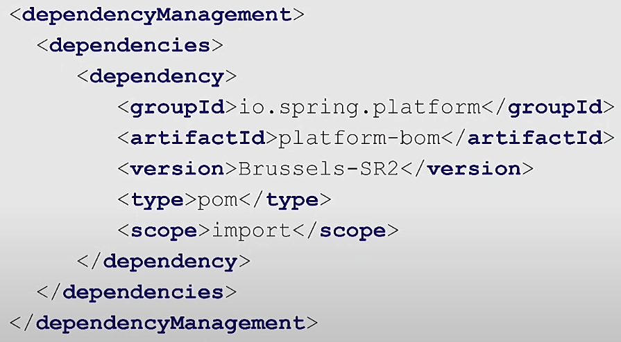
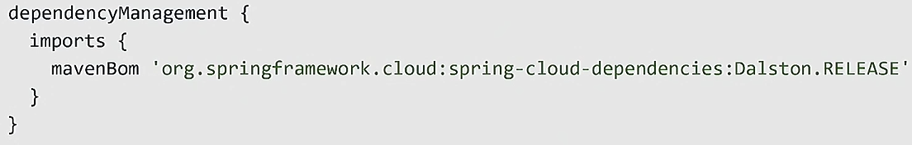
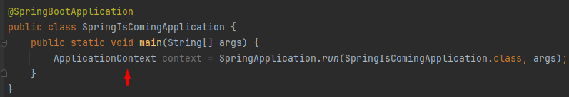

# Spring is coming

Проект сделан на основе видео: 
[Евгений Борисов, Кирилл Толкачев — Boot yourself, Spring is coming (Часть 1)](https://www.youtube.com/watch?v=yy43NOreJG4&ab_channel=JPoint%2CJoker%D0%B8JUGru) 

## API Железного банка

[API](http://localhost:8080/swagger-ui/index.html)

## Решение конфликта версий в spring-boot

<b>Согласованные версии лежат в spring-boot-dependencies</b>

 0. наш проект содержит в блоке parent spring-boot-starter-parent. 
 1. spring-boot-starter-parent в блоке parent содержит spring-boot-dependencies. 
 2. spring-boot-dependencies содержит блок dependencyManagement в котором лежат все согласованные
версии зависимостей, версия подтянется только в случает добавления зависимости в проект. 
 3. spring-boot-dependencies можно подключить и отдельно как pom файл в блоке dependencyManagement 
своего проекта. 

<b>Если в компании используется свой parent pom</b>

Если необходимо наследовать разрешение версий зависимостей из  spring-boot-dependencies и
из своего корпоративного pom файла с зависимостями можно использовать bom файл указав его в блоке
dependencyManagement.

## spring-boot-starter

Что делает spring-boot-starter:

- агрегирует в себе все зависимости для работы с нужной функциональностью
- делает дефолтную настройку компонентов для работы функционала сразу после подключения starter'а (В контексте
  приложения будет много бинов!)

### Инвертируем контроль для spring-starter

<b>org.springframework.boot.autoconfigure.AutoConfiguration.imports + @ConditionalOn...</b>

Для того чтобы человеку использующему starter не пришлось знать о внутренностях starter'а
(например использовать @EnableSomeStarter или @Import(SomeStarterConfig.class)) мы должны сделать
подключение starter'а и его конфигурацию легкой и простой, для этого есть файл org.springframework.boot.autoconfigure.AutoConfiguration.imports
и различные варианты @ConditionalOn...(@ConditionalOnProperty). 
Как работает org.springframework.boot.autoconfigure.AutoConfiguration.imports, 
spring-boot после того как нашел конфигурации основного приложения сканирует все jar
файлы подключенные к приложению и искать в них файл org.springframework.boot.autoconfigure.AutoConfiguration.imports, 
если файл найден он запускает конфигурацию указанную в нем. 
**После spring-boot 2.7 вместо файла spring.factories используется org.springframework.boot.autoconfigure.AutoConfiguration.imports**

## Контекст приложения

При использовании **обычного spring** мало того что все зависимости для работы той или иной функциональности
приходилось подключать самому так и делать настройку инфраструктурных и иных бинов для работы функциональности
нужно было делать самому с приходом **spring-boot-starter'ов** они это делают за нас (дефолтную настройку).

<b>Получить контекст в spring-boot</b>

Получить контекст в spring-boot тоже можно как и в обычном spring приложении

## @SpringBootApplication

В spring-boot приложении самая главная аннотация это @SpringBootApplication, она в себя включает другие аннотации:
@ComponentScan, @SpringBootConfiguration (@Configuration), @EnableAutoConfiguration, и так далее. Аннотации которые
есть в @SpringBootApplication в свою очередь несут другие аннотации. 
**По сути @SpringBootApplication это композиция самых нужных аннотаций для приложения!**

<b>@SpringBootConfiguration дает...</b>

Так как в аннотацию @SpringBootApplication входит @SpringBootConfiguration а в нее входит @Configuration, то благодаря
этомы в классе помеченным @SpringBootApplication мы можем объявлять бины через метод помеченный аннотацией @Bean как
обычно и делается в классе помеченным @Configuration.

<b>@ComponentScan дает...</b>

Так как в аннотацию @SpringBootApplication входит @ComponentScan то при старте приложения происходит сканирование всех 
пакетов и под пакетов, тем самым все бины из пакетов и под-пакетов, где лежит класс помеченный @SpringBootApplication 
автоматически сканируются и попадают в контекст.

<b>@EnableAutoConfiguration дает...</b>

Самая главная задача данной аннотации сделать импорт @Import({AutoConfigurationImportSelector.class}), AutoConfigurationImportSelector
по сути через SpringFactoriesLoader сканирует jar файлы и ищет файл org.springframework.boot.autoconfigure.AutoConfiguration.imports и запускает указанные
там конфигурации, таким образом стартеры запускаются и их бины попадают в контекст.

## Логика по самописным Conditional

<b>Сколько раз вызывается @Conditional, ответ 3-4 раза</b>

Вызовется 1 раз если Conditional в starter'е/приложении поставить над компонентом созданным через метод помеченный @Bean 
Вызовется 3 раз если Conditional в starter'е поставить над компонентом @Configuration, @Service, @Component и т.д. 
Вызовется 4 раз если Conditional в приложении поставить над компонентом @Configuration, @Service, @Component и т.д. 

**Так как Condtitional логика вызовется 3-4 раза и если она дорогая ее самому следует кэшировать!**