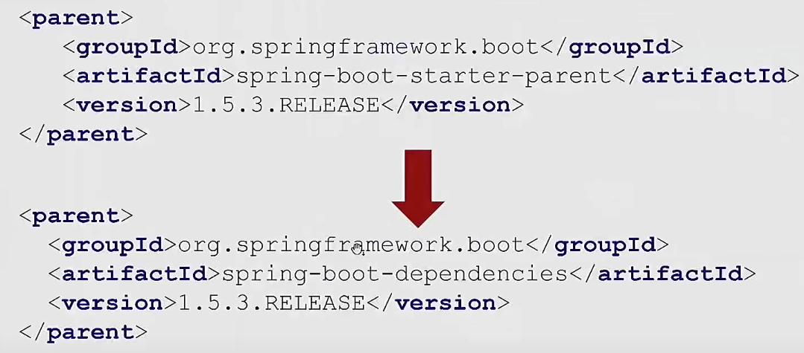

# Spring is coming

Проект сделан на основе видео: 
[Евгений Борисов, Кирилл Толкачев — Boot yourself, Spring is coming (Часть 1)](https://www.youtube.com/watch?v=yy43NOreJG4&ab_channel=JPoint%2CJoker%D0%B8JUGru) 

## API Железного банка

[API](http://localhost:8080/swagger-ui/index.html)

## Решение конфликта версий в spring-boot

<b>Согласованные версии лежат в spring-boot-dependencies</b>

 0. наш проект содержит в блоке parent spring-boot-starter-parent. 
 1. spring-boot-starter-parent в блоке parent содержит spring-boot-dependencies. 
 2. spring-boot-dependencies содержит блок dependencyManagement в котором лежат все согласованные
версии зависимостей, версия подтянется только в случает добавления зависимости в проект. 
 3. spring-boot-dependencies можно подключить и отдельно как pom файл в блоке dependencyManagement 
своего проекта. 

<b>Если в компании используется свой parent pom</b>

Если необходимо наследовать разрешение версий зависимостей из  spring-boot-dependencies и
из своего корпоративного pom файла с зависимостями можно использовать bom файл указав его в блоке
dependencyManagement.

## spring-boot-starter

Что делает spring-boot-starter:

- агрегирует в себе все зависимости для работы с нужной функциональностью
- делает дефолтную настройку компонентов для работы функционала сразу после подключения starter'а (В контексте
  приложения будет много бинов!)

### Инвертируем контроль для spring-starter

Для того чтобы человеку использующему starter не пришлось знать о внутренностях starter'а
(например использовать @EnableSomeStarter или @Import(SomeStarterConfig.class)) мы должны сделать
подключение starter'а и его конфигурацию легкой и простой, для этого есть файл spring.factories и различные варианты
@ConditionalOn...(@ConditionalOnProperty). 
Как работает spring.factories, spring-boot после того как нашел конфигурации основного приложения сканирует все jar
файлы
подключенные к приложению и искать в них файл spring.factories, если файл найден он запускает конфигурацию указанную в
нем. 
**После spring-boot 2.7 вместо файла spring.factories используется
org.springframework.boot.autoconfigure.AutoConfiguration.imports**
## Контекст приложения

При использовании **обычного spring** мало того что все зависимости для работы той или иной функциональности
приходилось подключать самому так и делать настройку инфраструктурных и иных бинов для работы функциональности
нужно было делать самому с приходом **spring-boot-starter'ов** они это делают за нас (дефолтную настройку).

<b>Получить контекст в spring-boot</b>

Получить контекст в spring-boot тоже можно как и в обычном spring приложении

